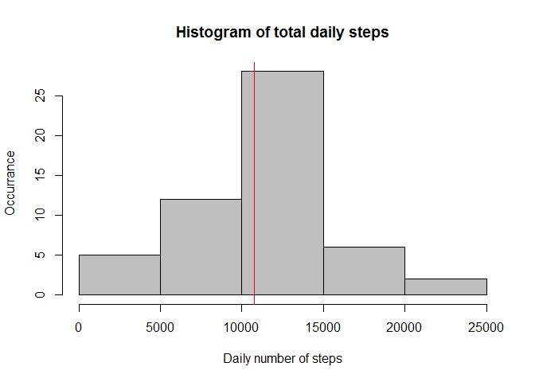
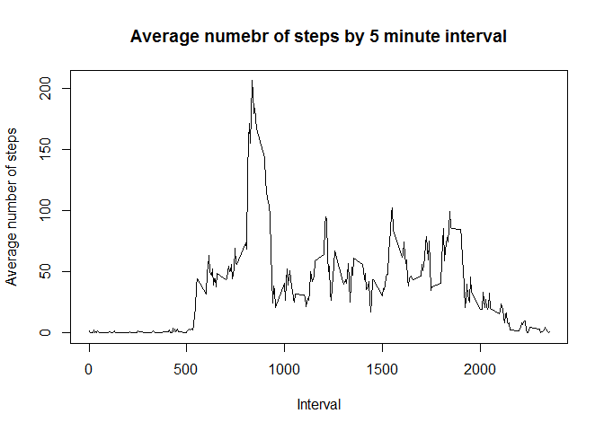
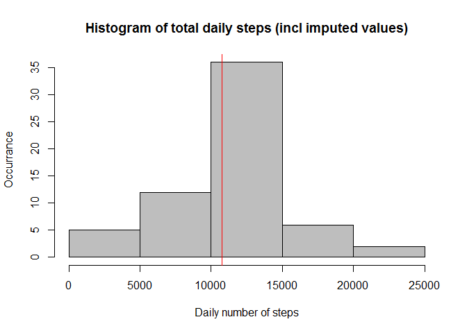
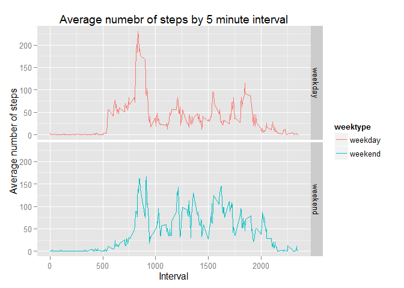

# Reproducible Research Project 1
Greg Main  
11 October 2015  
## Overview

It is now possible to collect a large amount of data about personal movement using activity monitoring devices such as a Fitbit, Nike Fuelband, or Jawbone Up. These type of devices are part of the "quantified self" movement - a group of enthusiasts who take measurements about themselves regularly to improve their health, to find patterns in their behavior, or because they are tech geeks. 

This assignment makes use of data from a personal activity monitoring device. This device collects data at 5 minute intervals through out the day. The data consists of two months of data from an anonymous individual collected during the months of October and November, 2012 and include the number of steps taken in 5 minute intervals each day.

## Data

The data for this assignment can be downloaded from https://d396qusza40orc.cloudfront.net/repdata%2Fdata%2Factivity.zip

The variables included in this dataset are:

1. steps: Number of steps taking in a 5-minute interval (missing values are coded as NA) 
2. date: The date on which the measurement was taken in YYYY-MM-DD format 
3. interval: Identifier for the 5-minute interval in which measurement was taken 

The dataset is stored in a comma-separated-value (CSV) file and there are a total of 17,568 observations in this dataset.

## Load the required packages for the assignment

```r
library(dplyr)
library(ggplot2)
library(lattice)
library(lubridate)
```

## Loading and preprocessing the data

Download and unzip the file required for the project. Read in the data which is in a csv format accepting the headings in the file as the data fields


```r
fileUrl <- "http://d396qusza40orc.cloudfront.net/repdata%2Fdata%2Factivity.zip"
download.file(fileUrl,destfile="./repdata-data-activity")
unzip(zipfile="./repdata-data-activity")
actdata<-read.csv("./activity.csv",sep=",",header=TRUE, na.strings='NA')
```

Format the date column appropriately for later analysis


```r
actdata$date <- as.Date(actdata$date, format="%Y-%m-%d")
```

## What is mean total number of steps taken per day?

Summarise the number of steps taken by date (excluding the null values) using the dplyr package.


```r
dailyact <- actdata %>% 
        filter(!is.na(steps)) %>%
        group_by(date) %>% 
        summarise(steps = sum(steps, na.rm=FALSE)) %>% 
        arrange(date)
        str(dailyact)
```

```
## Classes 'tbl_df', 'tbl' and 'data.frame':	53 obs. of  2 variables:
##  $ date : Date, format: "2012-10-02" "2012-10-03" ...
##  $ steps: int  126 11352 12116 13294 15420 11015 12811 9900 10304 17382 ...
```

Create a histogram of the total number of steps per day (including vertical indicators for median and mean measures)


```r
hist(dailyact$steps, main="Histogram of total daily steps", breaks=5, col="grey", ylab="Occurrance", xlab="Daily number of steps")
abline(v=mean(dailyact$steps),col="blue")
abline(v=median(dailyact$steps),col="red")
```

 

Calculate the mean and the median daily steps values


```r
medianhrsteps<-median(dailyact$steps, na.rm=TRUE)
meanhrsteps<-mean(dailyact$steps, na.rm=TRUE)
```

The median is 10765 and the mean is 1.0766189\times 10^{4}

## What is the average daily activity pattern?

Summarise the average number of steps taken for each 5 minute interval using the dplyr package by interval.


```r
Intact <- actdata %>% 
        filter(!is.na(steps)) %>%
        group_by(interval) %>% 
        summarise(steps = mean(steps, na.rm=FALSE)) %>% 
        arrange(interval)
        str(Intact)
```

```
## Classes 'tbl_df', 'tbl' and 'data.frame':	288 obs. of  2 variables:
##  $ interval: int  0 5 10 15 20 25 30 35 40 45 ...
##  $ steps   : num  1.717 0.3396 0.1321 0.1509 0.0755 ...
```


Create a line chart of average steps by 5 minute interval


```r
with(Intact, plot(interval, steps, type="l", xlab="Interval",ylab="Average number of steps", main="Average numebr of steps by 5 minute interval"))
```

 

Calculate the 5-minute interval, on average across all the days in the dataset and then determine which contains the maximum number of steps


```r
maxsteps<-max(Intact$steps, na.rm=TRUE)
maxstepsline<-filter(Intact, steps==max(Intact$steps))
maxstepsint<-maxstepsline[,1]
```

Interval 835 on average contains the maximum number of steps (being 206.1698113) 

## Imputing missing values

Calculate the number of rows in the data that contain NA values


```r
NA_values<-sum(is.na(actdata$steps))
```

The number of rows that contain NA values in the steps column is 2304 

Create a new dataset that is equal to the original dataset but with the missing data filled in. This has been done by using the average number of steps per 5-minute interval:


```r
actdata_full <- actdata
nas <- is.na(actdata_full$steps)
avg_interval <- tapply(actdata_full$steps, actdata_full$interval, mean, na.rm=TRUE, simplify=TRUE)
actdata_full$steps[nas] <- avg_interval[as.character(actdata_full$interval[nas])]
str(actdata_full)
```

```
## 'data.frame':	17568 obs. of  3 variables:
##  $ steps   : num  1.717 0.3396 0.1321 0.1509 0.0755 ...
##  $ date    : Date, format: "2012-10-01" "2012-10-01" ...
##  $ interval: int  0 5 10 15 20 25 30 35 40 45 ...
```

Confirm the new dataset contains no null or NA values


```r
NA_valuesclean<-sum(is.na(actdata_full$steps))
NA_valuesclean
```

```
## [1] 0
```

The number of rows in the cleaned dataset that contain NA values in the steps column is 0 

Create a histogram of the total number of steps taken each day by first summarising the data by day, including the imputed values using the dplyr package.


```r
dailyactfull <- actdata_full %>% 
        filter(!is.na(steps)) %>%
        group_by(date) %>% 
        summarise(steps = sum(steps, na.rm=FALSE)) %>% 
        arrange(date)
        str(dailyactfull)
```

```
## Classes 'tbl_df', 'tbl' and 'data.frame':	61 obs. of  2 variables:
##  $ date : Date, format: "2012-10-01" "2012-10-02" ...
##  $ steps: num  10766 126 11352 12116 13294 ...
```

Create a histogram of the total number of steps per day (including vertical indicators for median and mean measures) 


```r
hist(dailyactfull$steps, main="Histogram of total daily steps (incl imputed values)", breaks=5, col="grey", ylab="Occurrance", xlab="Daily number of steps")
abline(v=mean(dailyactfull$steps),col="blue")
abline(v=median(dailyactfull$steps),col="red")
```

 

Calculate and report the mean and median total number of steps taken per day. 


```r
medianhrstepsfull<-median(dailyactfull$steps)
meanhrstepsfull<-mean(dailyactfull$steps)
mediandiff<-medianhrstepsfull - medianhrsteps
meandiff<-meanhrstepsfull - meanhrsteps 
```

The median is 1.0766189\times 10^{4} and the mean is 1.0766189\times 10^{4}

Do these values differ from the estimates from the first part of the assignment? What is the impact of imputing missing data on the estimates of the total daily number of steps?

The difference between the original and cleaned dataset is as follows (imputed date set minus original dataset): 

Median: 1.0766189\times 10^{4} - 10765= 1.1886792 

Mean: 1.0766189\times 10^{4} - 10765 = 0 

## Are there differences in activity patterns between weekdays and weekends?

Create a new dataset with the day of the week and a flag with week v weekend day


```r
actdata_full$day <- weekdays(as.Date(actdata_full$date))
actdata_full_day <- mutate(actdata_full, weektype = ifelse(weekdays(actdata_full$date) == "Saturday" | weekdays(actdata_full$date) == "Sunday", "weekend", "weekday"))
actdata_full_day$weektype <- as.factor(actdata_full_day$weektype)
head(actdata_full_day)
```

```
##       steps       date interval    day weektype
## 1 1.7169811 2012-10-01        0 Monday  weekday
## 2 0.3396226 2012-10-01        5 Monday  weekday
## 3 0.1320755 2012-10-01       10 Monday  weekday
## 4 0.1509434 2012-10-01       15 Monday  weekday
## 5 0.0754717 2012-10-01       20 Monday  weekday
## 6 2.0943396 2012-10-01       25 Monday  weekday
```

Make a panel plot containing a time series plot of the 5-minute interval (x-axis) and the average number of steps taken, averaged across all weekday days or weekend days (y-axis).

Summarise the average number of steps taken for each 5 minute interval using the dplyr package by interval.


```r
Intact_day <- actdata_full_day %>% 
        group_by(interval, weektype) %>% 
        summarise(steps = mean(steps)) 
        ## arrange(interval, weektype) %>%
        ## str(Intact_day)
```

Create a line chart of average steps by 5 minute interval


```r
g <- ggplot(Intact_day, aes(interval, steps))
        g + geom_line(aes(color=weektype)) +
        facet_grid(weektype~.) +
        labs(x="Interval") +
        labs(y="Average number of steps") +
        labs(title="Average numebr of steps by 5 minute interval")
```

 

```r
summary(g)
```

```
## data: interval, weektype, steps [576x3]
## mapping:  x = interval, y = steps
## faceting: facet_null()
```

Based on the above plot it seems that the test object is more active earlier in the day during weekdays compared to weekends, but more active overall on the weekends compared with weekdays (this is likely due to the subjects working during the weekdays, hence moving less during the day).
